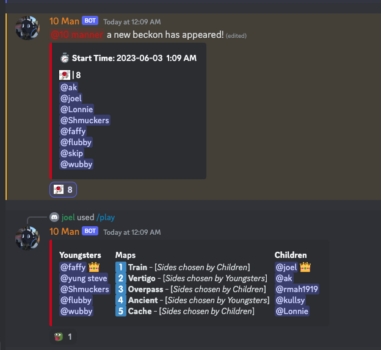

## tenbotter

A Discord bot for managing CS:GO 10man's built in ruby.

### Getting Started

1. bin/setup
2. Setup a [new Discord application](https://discord.com/developers/applications)
3. Go to the bot page `https://discord.com/developers/applications/{app_id}/bot`
4. Grab the token and insert into `.env` file which was created for you.
5. Add the bot to your server https://discord.com/oauth2/authorize?client_id={app_id}&scope=bot&permissions=8

Note: At the moment a lot of the things are hard-coded, and will not work for other server beyond the one it has been configured for. Soon there will be more configuration options.